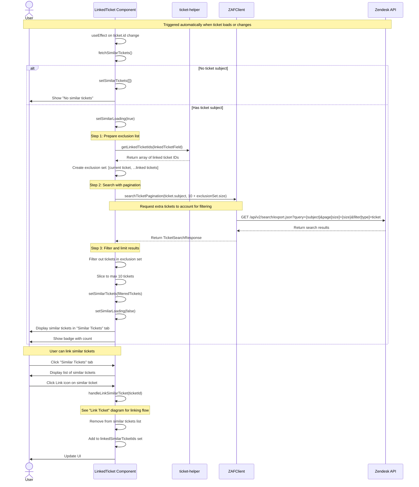

# Get Similar Tickets Sequence Diagram

This diagram shows the automatic flow for fetching and displaying similar tickets based on the current ticket's subject.

## Key Components

- **LinkedTicket Component** (`linked-ticket.tsx`): Manages similar tickets display and linking
- **TicketHelper** (`ticket-helper.ts`): Extracts linked ticket IDs
- **ZAFClient** (`zaf-client.ts`): API client wrapper
- **Zendesk API**: External API for ticket search

## Key Functions

- `fetchSimilarTickets()`: Main function to fetch similar tickets
- `searchTicketPagination(query, size)`: Search API with pagination support
- `getLinkedTicketIds(linkedTicketField)`: Extract IDs from linked ticket field
- `handleLinkSimilarTicket(ticketId)`: Initiates linking from similar tickets

## Important Notes

- **Automatic Trigger**: Runs automatically when ticket loads or ticket ID changes
- **Smart Filtering**: Excludes current ticket and already linked tickets from results
- **Over-fetching Strategy**: Requests more tickets than needed (10 + exclusion count) to ensure 10 results after filtering
- **Limit**: Maximum 10 similar tickets displayed
- **Search Query**: Uses ticket subject as search query
- **UI Integration**: Displays in "Similar Tickets" tab with count badge
- **State Tracking**: Tracks which similar tickets have been linked to restore them if unlinked

## Search API Details

- **Endpoint**: `/api/v2/search/export.json`
- **Parameters**:
  - `query`: Ticket subject
  - `page[size]`: Number of results
  - `filter[type]`: Set to "ticket"
