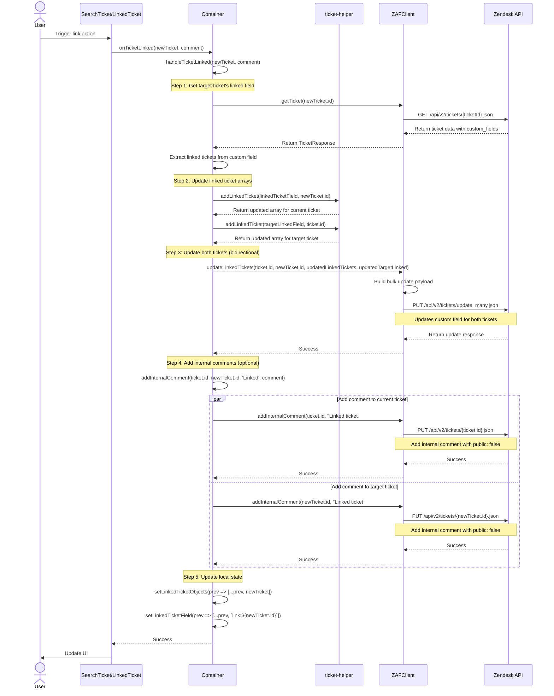

# Link Ticket Sequence Diagram

This diagram shows the complete flow when linking two tickets together, including bidirectional linking and internal comment creation.

## Key Components

- **Container** (`container.tsx`): Orchestrates the linking process
- **TicketHelper** (`ticket-helper.ts`): Helper functions for managing linked ticket arrays
- **ZAFClient** (`zaf-client.ts`): API client wrapper
- **Zendesk API**: External API

## Key Functions

- `handleTicketLinked(newTicket, comment)`: Main linking orchestration
- `getTargetTicketLinkedField(ticketId)`: Fetches target ticket's current linked tickets
- `addLinkedTicket(linked, ticketId)`: Adds ticket ID to linked array
- `updateLinkedTickets()`: Bulk updates both tickets' custom fields
- `addInternalComment()`: Adds internal comment to both tickets

## Important Notes

- **Bidirectional Linking**: Both tickets are updated to reference each other
- **Custom Field Format**: Linked tickets stored as comma-separated string: `"link:123,link:456"`
- **Internal Comments**: Added to both tickets with optional user comment
- **Atomic Operation**: Uses bulk update API to ensure consistency
