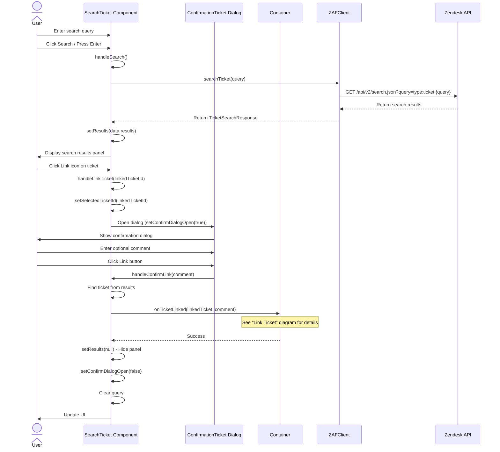

# Search Ticket Sequence Diagram

This diagram shows the flow when a user searches for tickets and links one to the current ticket.

## Key Components

- **SearchTicket Component** (`search-ticket.tsx`): Handles search UI and user interactions
- **ConfirmationTicket Dialog** (`confirmation-ticket.tsx`): Prompts for optional internal comment
- **Container** (`container.tsx`): Manages ticket linking logic
- **ZAFClient** (`zaf-client.ts`): Wrapper for Zendesk API calls
- **Zendesk API**: External API for ticket operations

## Key Functions

- `handleSearch()`: Initiates ticket search
- `searchTicket(query)`: Makes API call to search tickets
- `handleLinkTicket(ticketId)`: Opens confirmation dialog
- `handleConfirmLink(comment)`: Processes ticket linking with optional comment
