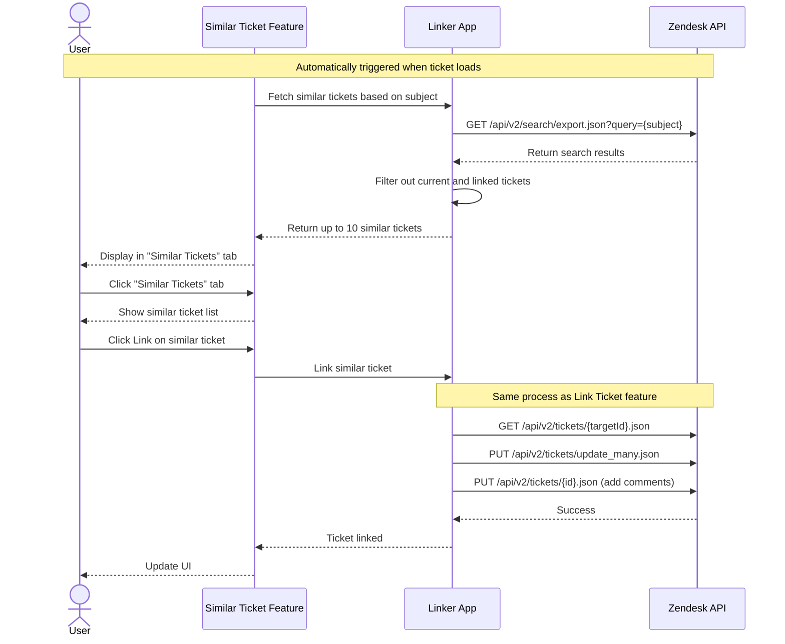

# Get Similar Tickets - Simplified Sequence Diagram

```mermaid
sequenceDiagram
    actor User
    participant SimilarTicket as Similar Ticket Feature
    participant Linker as Linker App
    participant ZendeskAPI as Zendesk API

    Note over User,ZendeskAPI: Automatically triggered when ticket loads
    
    SimilarTicket->>Linker: Fetch similar tickets based on subject
    Linker->>ZendeskAPI: GET /api/v2/search/export.json?query={subject}
    ZendeskAPI-->>Linker: Return search results
    Linker->>Linker: Filter out current and linked tickets
    Linker-->>SimilarTicket: Return up to 10 similar tickets
    SimilarTicket-->>User: Display in "Similar Tickets" tab
    
    User->>SimilarTicket: Click "Similar Tickets" tab
    SimilarTicket-->>User: Show similar ticket list
    
    User->>SimilarTicket: Click Link on similar ticket
    SimilarTicket->>Linker: Link similar ticket
    
    Note over Linker,ZendeskAPI: Same process as Link Ticket feature
    Linker->>ZendeskAPI: GET /api/v2/tickets/{targetId}.json
    Linker->>ZendeskAPI: PUT /api/v2/tickets/update_many.json
    Linker->>ZendeskAPI: PUT /api/v2/tickets/{id}.json (add comments)
    ZendeskAPI-->>Linker: Success
    
    Linker-->>SimilarTicket: Ticket linked
    SimilarTicket-->>User: Update UI
```
