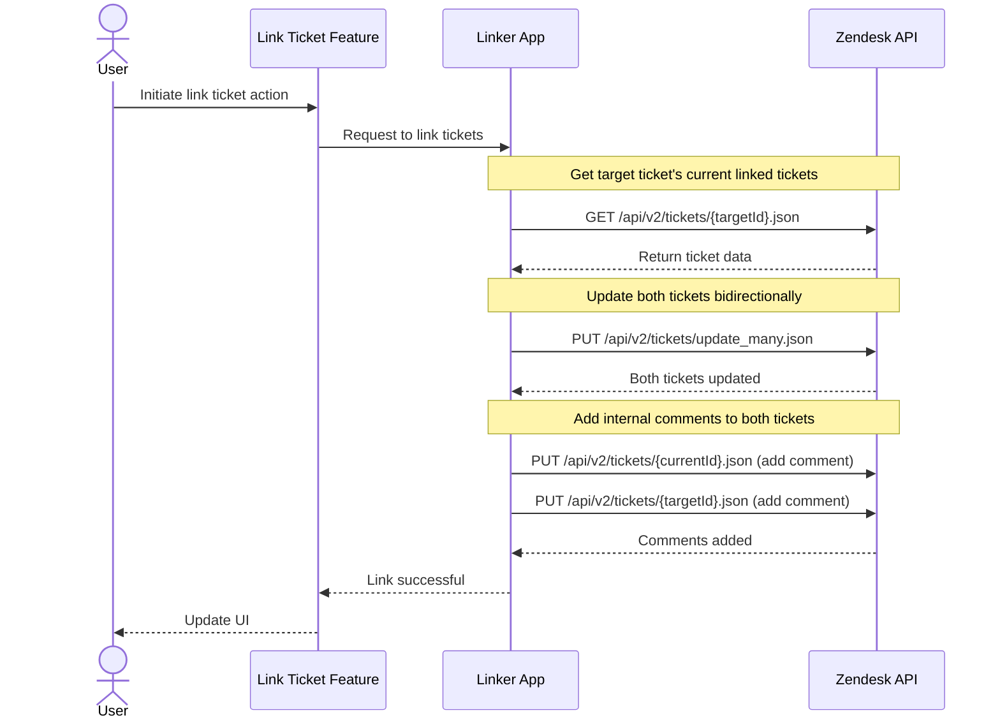

# Link Ticket - Simplified Sequence Diagram

```mermaid
sequenceDiagram
    actor User
    participant LinkTicket as Link Ticket Feature
    participant Linker as Linker App
    participant ZendeskAPI as Zendesk API

    User->>LinkTicket: Initiate link ticket action
    LinkTicket->>Linker: Request to link tickets
    
    Note over Linker,ZendeskAPI: Get target ticket's current linked tickets
    Linker->>ZendeskAPI: GET /api/v2/tickets/{targetId}.json
    ZendeskAPI-->>Linker: Return ticket data
    
    Note over Linker,ZendeskAPI: Update both tickets bidirectionally
    Linker->>ZendeskAPI: PUT /api/v2/tickets/update_many.json
    ZendeskAPI-->>Linker: Both tickets updated
    
    Note over Linker,ZendeskAPI: Add internal comments to both tickets
    Linker->>ZendeskAPI: PUT /api/v2/tickets/{currentId}.json (add comment)
    Linker->>ZendeskAPI: PUT /api/v2/tickets/{targetId}.json (add comment)
    ZendeskAPI-->>Linker: Comments added
    
    Linker-->>LinkTicket: Link successful
    LinkTicket-->>User: Update UI
```
