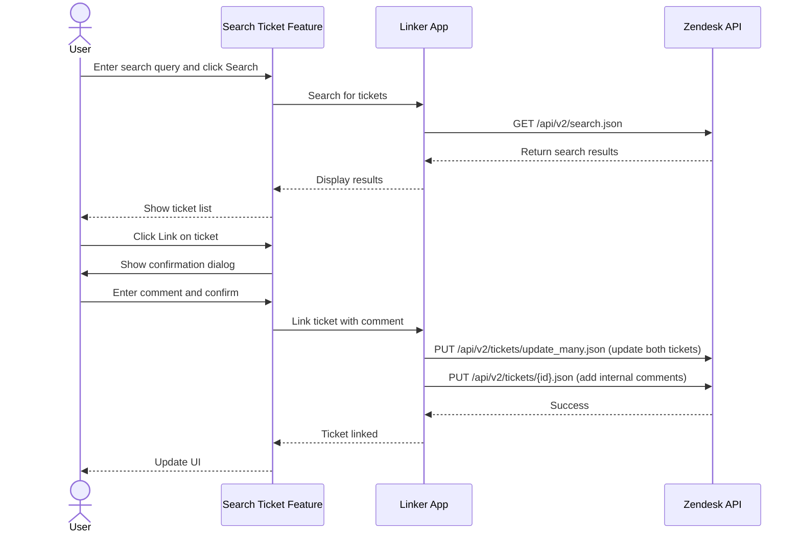

# Search Ticket - Simplified Sequence Diagram

```mermaid
sequenceDiagram
    actor User
    participant SearchTicket as Search Ticket Feature
    participant Linker as Linker App
    participant ZendeskAPI as Zendesk API

    User->>SearchTicket: Enter search query and click Search
    SearchTicket->>Linker: Search for tickets
    Linker->>ZendeskAPI: GET /api/v2/search.json
    ZendeskAPI-->>Linker: Return search results
    Linker-->>SearchTicket: Display results
    SearchTicket-->>User: Show ticket list
    
    User->>SearchTicket: Click Link on ticket
    SearchTicket->>User: Show confirmation dialog
    User->>SearchTicket: Enter comment and confirm
    SearchTicket->>Linker: Link ticket with comment
    Linker->>ZendeskAPI: PUT /api/v2/tickets/update_many.json (update both tickets)
    Linker->>ZendeskAPI: PUT /api/v2/tickets/{id}.json (add internal comments)
    ZendeskAPI-->>Linker: Success
    Linker-->>SearchTicket: Ticket linked
    SearchTicket-->>User: Update UI
```
