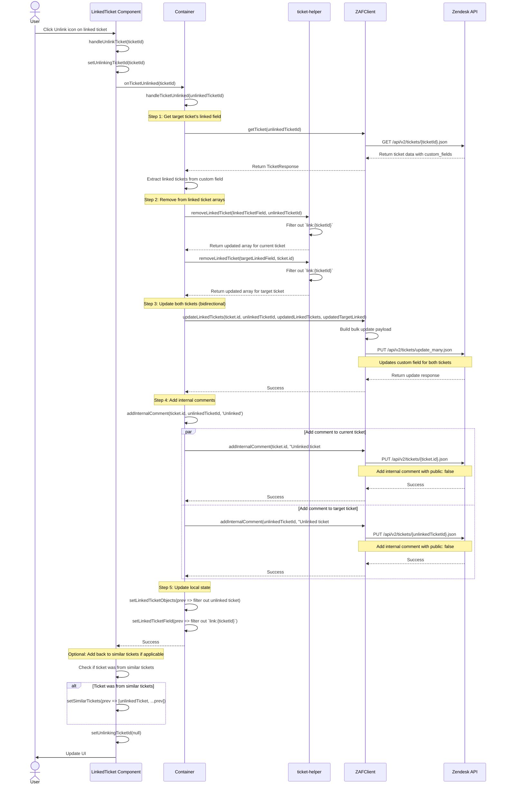

# Unlink Ticket Sequence Diagram

This diagram shows the flow when unlinking two previously linked tickets, including bidirectional removal and internal comment creation.

## Key Components

- **LinkedTicket Component** (`linked-ticket.tsx`): Displays linked tickets and handles unlink action
- **Container** (`container.tsx`): Orchestrates the unlinking process
- **TicketHelper** (`ticket-helper.ts`): Helper functions for managing linked ticket arrays
- **ZAFClient** (`zaf-client.ts`): API client wrapper
- **Zendesk API**: External API

## Key Functions

- `handleUnlinkTicket(ticketId)`: Initiates unlink process in component
- `handleTicketUnlinked(unlinkedTicketId)`: Main unlinking orchestration in container
- `getTargetTicketLinkedField(ticketId)`: Fetches target ticket's current linked tickets
- `removeLinkedTicket(linked, ticketId)`: Removes ticket ID from linked array
- `updateLinkedTickets()`: Bulk updates both tickets' custom fields
- `addInternalComment()`: Adds internal comment to both tickets

## Important Notes

- **Bidirectional Unlinking**: Both tickets are updated to remove references to each other
- **Internal Comments**: Added to both tickets to track the unlink action
- **Similar Tickets**: If the unlinked ticket was originally from similar tickets, it's added back to that list
- **Atomic Operation**: Uses bulk update API to ensure consistency
